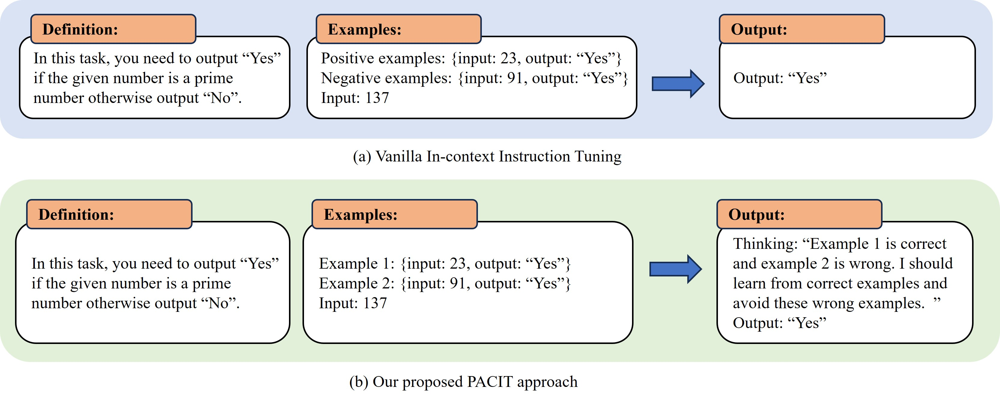
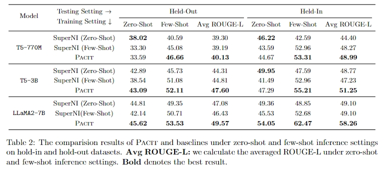

## PACIT
- This repo releases our implementation for the PACIT model.
- PACIT is a simple and effective in-context instruction tuning method inspired by the pedagogical concept of desirable difficulty. The PACIT method unlocks the power of examples by encouraging the model to actively learn to grasp the distinctions between the positive and negative examples instead of merely reading. The model is expected to first verify the correctness of the provided example according to the task description, which is then set as the condition for generating a better response to the task instance. 
- It is built based on the pretrained [T5 model](https://arxiv.org/abs/1910.10683) and [LLaMA](https://arxiv.org/pdf/2307.09288.pdf), and finetuned on SuperNI dataset [data](https://github.com/allenai/natural-instructions).



## Model Checkpoint
Model checkpoints are published on Huggingface hub: [T5-3B model](https://huggingface.co/happy-frog/T5_3B-PACIT), [T5-770M model](https://huggingface.co/happy-frog/T5_770M-PACIT/tree/main) and [LLaMA](https://huggingface.co/happy-frog/LLAMA_2-PACIT)

## Requirements

Our main experiments and analysis are conducted on the following environment:

- CUDA (12.2)
- Pytorch (2.1.2)
- Transformers (4.36.2)

```bash
pip install -r requirements.txt
```


## Quick Start
For a quick start, you can directly run PACIT.

# Dataset Processing
Our models are trained and evaluated on [Super-NaturalInstructions](https://github.com/allenai/natural-instructions), which can be cloned by running:

```bash
git clone git@github.com:allenai/natural-instructions.git data
```

Put the data under the path: "./Tk-Instruct-main/data"

We use TK-instruct-main to generate our base dataset and then use our python code to further process. You can run the shell directly
```shell
    bash script/data_processing.sh
```


# Training for baseline (SuperNI)

A sample script for training the baseline models. You can run it as follows:

```shell
    bash script/SuperNI_train
```

# Training for PACIT

A sample script for training PACIT models. You can run it as follows:

```shell
    bash script/PACIT_train
```

# Evaluation

A sample script for evaluating basline and PACIT models. You can run it as follows:

```shell
    bash script/SuperNI_evaluation_generation
```

```shell
    bash script/PACIT_GT_evaluation_generation
```

```shell
    bash script/PACIT_Random_evaluation_generation
```


## Model Performance

Here are the performance numbers (in ROUGE-L) for our tested models:



## Citation

```bib
@misc{xue2023tadis,
      title={TADIS: Steering Models for Deep-Thinking about Demonstration Examples}, 
      author={Tianci Xue and Ziqi Wang and Yixia Li and Yun Chen and Guanhua Chen},
      year={2023},
      eprint={2310.00901},
      archivePrefix={arXiv},
      primaryClass={cs.CL}
}
```
